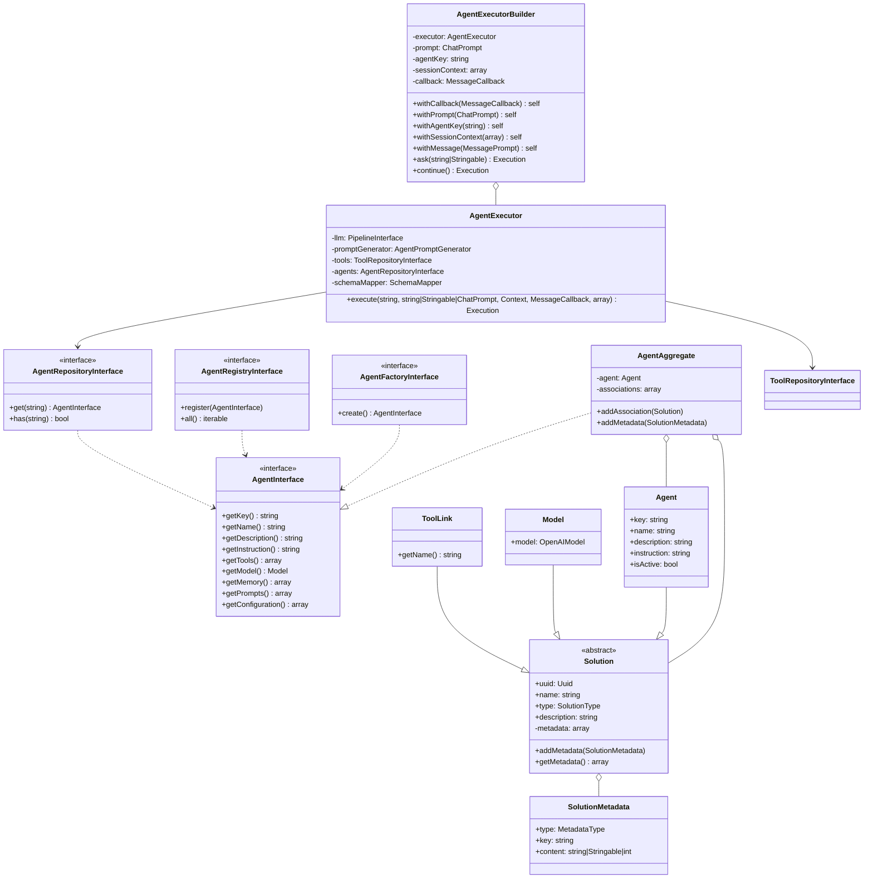

# Agent Domain Layer Diagram

This mermaid diagram provides a visual representation of the Agent domain layer, showcasing the main classes,
interfaces, and their relationships. Here's a brief explanation of the diagram:

AgentInterface is the core interface that defines the contract for agents.
AgentAggregate implements AgentInterface and aggregates an Agent instance along with other Solution objects.
Agent, Model, and ToolLink all inherit from the abstract Solution class.
Solution has a composition relationship with SolutionMetadata.
AgentExecutor is responsible for executing agents and depends on various interfaces and classes.
AgentExecutorBuilder is used to build and configure AgentExecutor instances.
AgentFactoryInterface, AgentRepositoryInterface, and AgentRegistryInterface are interfaces for creating, retrieving, and
registering agents, respectively.

